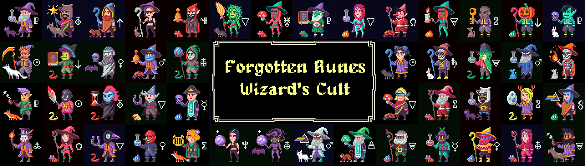

  

# Forgotten Runes Wizard's Cult Website 

This repository contains the website for [Forgotten Runes Wizard's Cult](https://forgottenrunes.com).

## Architecture

The site uses Next.js for the core framework with [Phaser](http://phaser.io/) for the game engine.

For web3 connections we use a combination of Alchemy, Infura, and the users injected provider (e.g. Metamask).

## The Guilds

This website is under the purview of the _Coding Guild_ with contributions from the other guilds such as _Art and Lore_, the _Gathering_, and the _Hype_ Guilds.

> Being a Verified Wizard is a prerequisite to joining any Guild.

## Getting Involved

Join the [Discord Channel](https://discord.com/invite/forgottenrunes) and chat with Dotta or any member of the Coding Guild.

  

